NOM : DEHONDT / ESSAN
Prénom : Gabin / Ange
Classe : B1 CIEL IR

<h2 style="texte-align:center">Mise en œuvre du MQTT avec un ESP8266</h2>

**1. Expression du besoin client**

L'entreprise a besoin d'un systeme pour contrôler la température et l'humidité d'une salle des serveurs. 
Pour résoudre se problème on utilisera un DHT11 et un ESP8266, tout cela en connection WIFI vers un Raspberry qui va récuperer les données (température et humidité) et les mettre en place par Node-Red.

**2. Schéma de principe**

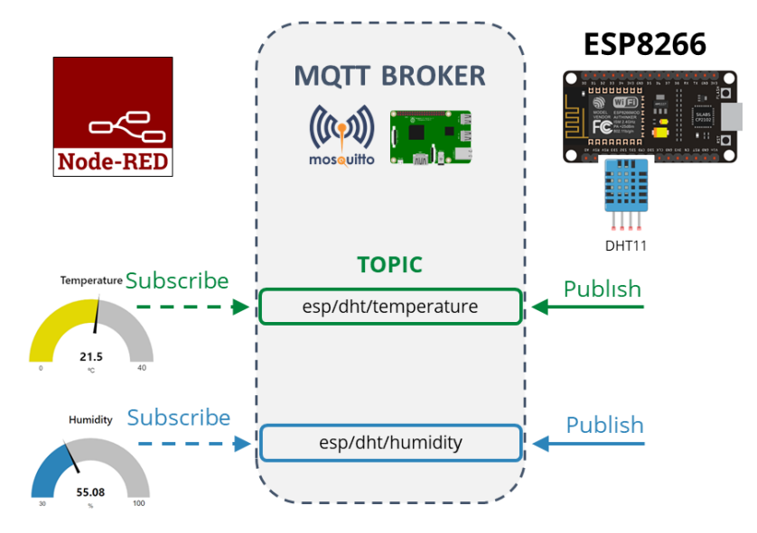

**3. Découverte du broker mosquitto**

<dd>
3.1 Câblage du Raspberry
    
- Adresse IP : 192.168.112.104

3.2 Installation de mosquitto

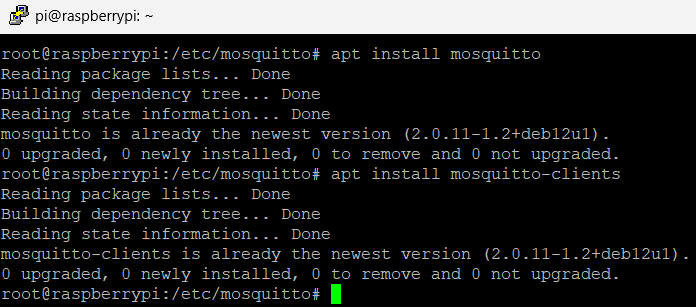

3.3 Test de fonctionnement de mosquitto

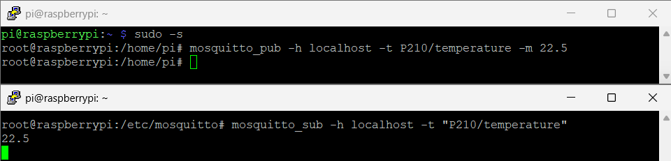
</dd>
 

**4. Test de fonctionnement ESP8266**

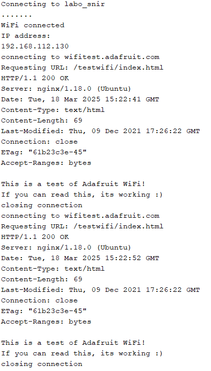

**5. Test de fonctionnement mqtt**

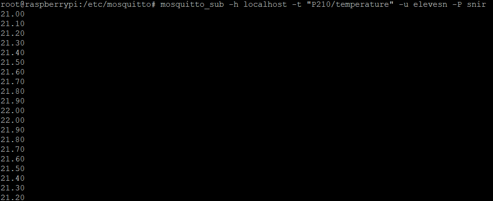
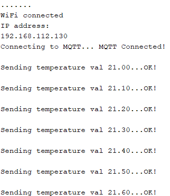

 

**6. Affichage des valeurs avec Node-Red**

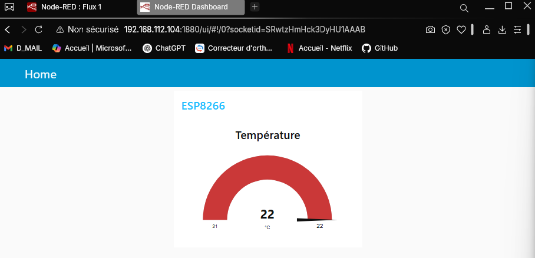
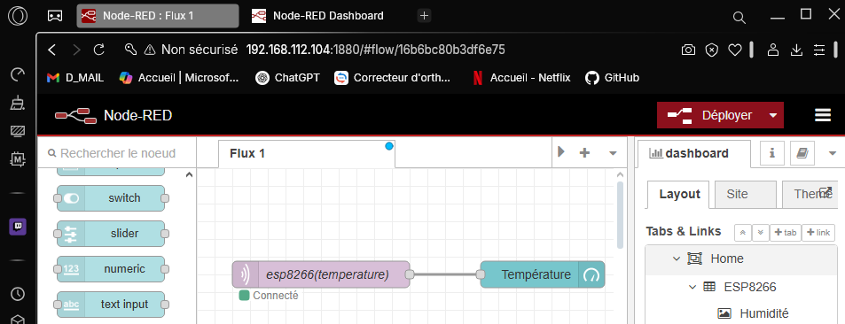

**7. Câblage du DHT11**

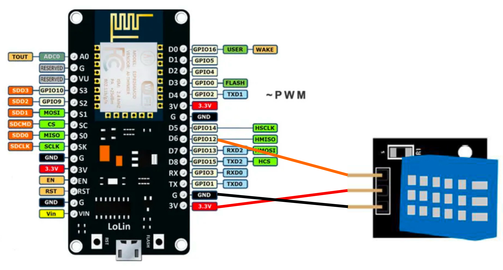

**8. Modification du programme de l’esp8266 pour transmettre la température et l’humidité**

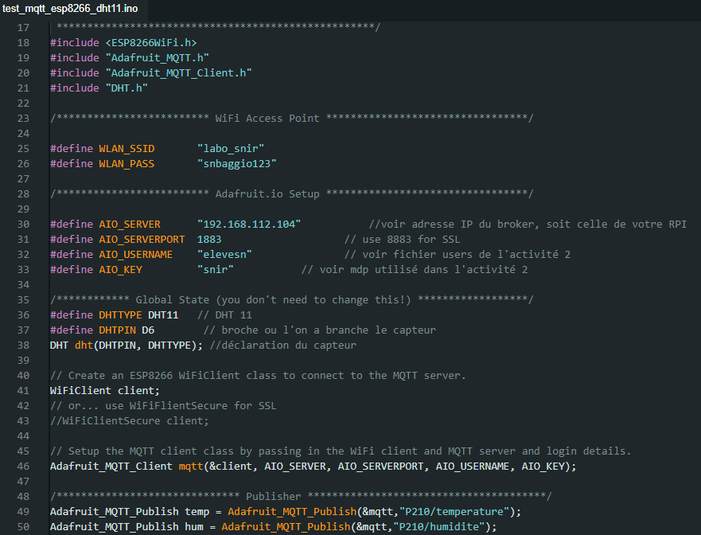

**9. Affichage de la température et de l’humidité avec Node-Red**

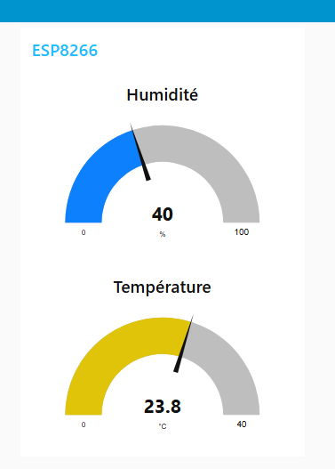

**10. Mise en place d'une interface web pour remplacer Node-Red**

- Inscription :

    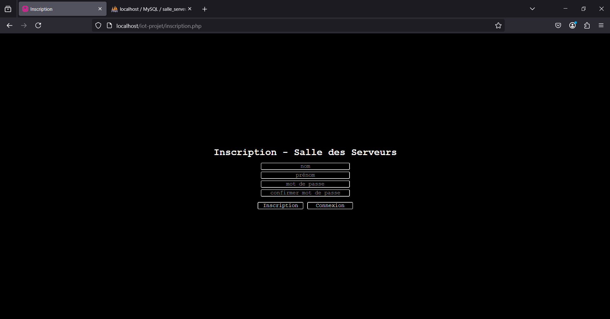
    - Création d'un utilisateur avec nom, prénom, mot de passe hasher en argon2.
     

- Connexion : 

    
    - Identification de l'utilisateur par la vérification du mot de passe, et recupération du nom ainsi que la première lettre du prénom pour afficher sur l'interface.
     

- Interface : 

    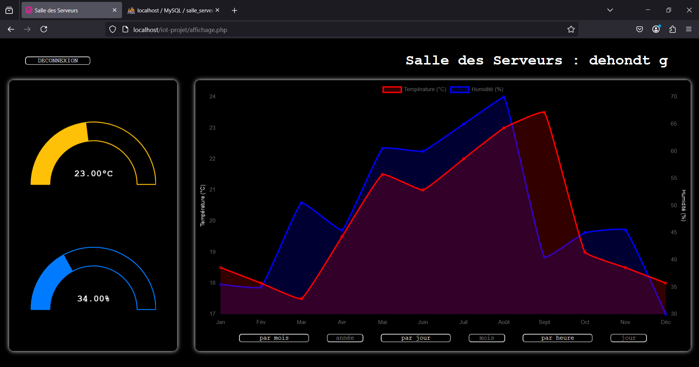
    - Affichage des données en direct de la température et l'humidité envoyé par l'ESP8266 à la base de donnée et recupérer par le PHP sur l'interface.
    - Affichage des données sur l'ensemble de l'année par la moyenne de chaque mois de l'année choix.
     

