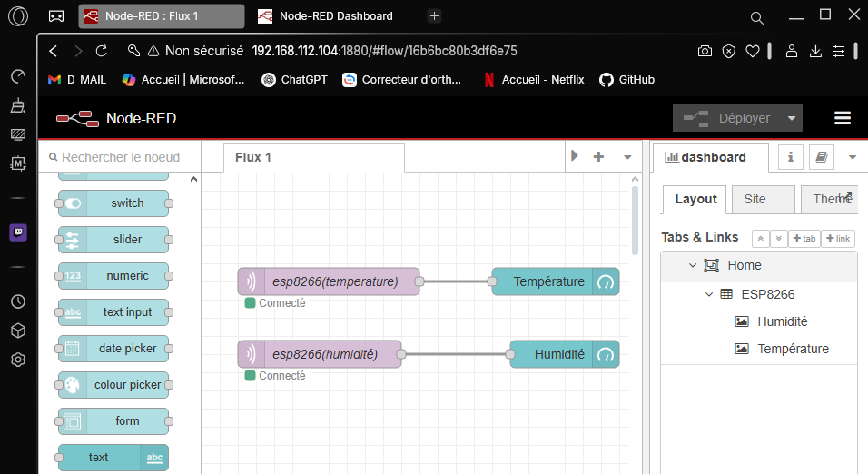

NOM : DEHONDT
Prénom : Gabin
Classe : B1 CIEL IR

<h2 style="texte-align:center">Mise en œuvre du MQTT avec un ESP8266</h2>

**1. Expression du besoin client**

L'entreprise a besoin d'un systeme pour contrôler la température et l'humidité d'une salle des serveurs. 
Pour résoudre se problème on utilisera un DHT11 et un ESP8266, tout cela en connection WIFI vers un Raspberry qui va récuperer les données (température et humidité) et les mettre en place par Node-Red.

**2. Schéma de principe**

**3. Découverte du broker mosquitto**

<dd>
3.1 Câblage du Raspberry
    
- Adresse IP : 192.168.112.104

3.2 Installation de mosquitto

3.3 Test de fonctionnement de mosquitto

</dd>
 

**4. Test de fonctionnement ESP8266**

**5. Test de fonctionnement mqtt**

 

**6. Affichage des valeurs avec Node-Red**

**7. Câblage du DHT11**

**8. Modification du programme de l’esp8266 pour transmettre la température et l’humidité**

**9. Affichage de la température et de l’humidité avec Node-Red**

